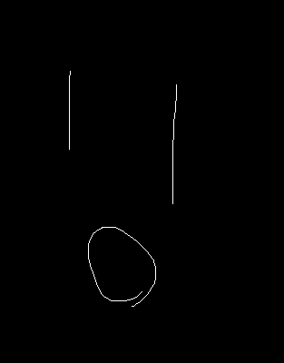

<!--
theme: gaia
paginate: true

style: |
  :root {
    background-color: #ffffff;
  }
  section {
    background-image: url(./logo.png); /* <- ロゴのURL */
    background-position: right 30px top 30px; /* <- ロゴの位置（右上、オフセットあり） */
    background-size: 150px 24px; /* <- ロゴのサイズ */
    background-repeat: no-repeat /* 共通 */;
  }

_class: lead

-->

# hello-world

サブタイトル

@epsilonGtMyon

---

# 画像を左に



- あああ
- bbb

---

# 箇条書きをする

- １つめ
  - あれこれ
- ２つめ
  - それどれあああああああああああああああ
- ３つめ
- ４つめ
- ５つめ


--- 

# テーブル

| ヘッダ１ | ヘッダ２ |
| ---- | ---- |
| a01 | bbbb |
| a02 | bbbb |
| a03 | bbbb |
| a04 | bbbb |
| a05 | bbbb |
| a06 | bbbb |
| a07 | bbbb |
| a08 | bbbb |

--- 

# コード例

```java
package app.hoge;

import java.util.List;

public class MyClass {

    // aaa
    public static void main(String[] args){
        String value01 = "value01";
        String value02 = "value01";
        String value03 = "value01";
        String value04 = "value01";
        System.out.println();
    }
}
```